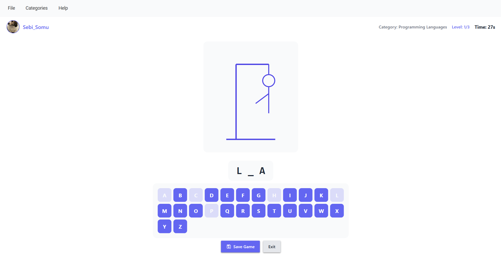

# Hangman - A Modern WPF Implementation

This project is a high-fidelity desktop implementation of the classic "Hangman" game, engineered using .NET and Windows Presentation Foundation (WPF). It serves as a comprehensive showcase of modern software engineering practices, prioritizing clean architecture, maintainability, and a premium user experience.

## Technologies

- **C# / .NET**: Core programming language and runtime.
- **WPF (Windows Presentation Foundation)**: UI framework for building the desktop experience.
- **Material Design In XAML Toolkit**: Modern UI/UX library for sleek, material-inspired controls.
- **System.Text.Json**: High-performance JSON serialization for data persistence.

## Application Functionality

The application is structured to provide a complete gaming ecosystem, ranging from user personalization to advanced session management.

### User Profiles & Personalization
- **Account Management**: Users can create unique profiles, ensuring their progress and settings are isolated and persistent.
- **Security**: Security is a priority; user passwords are encrypted using a robust hashing algorithm (`BCrypt` or similar implementation via `PasswordHasher`), ensuring that credentials are never stored in plain text.
- **Visual Identity**: A dedicated avatar system allows users to select from a rich gallery of predefined icons, fostering a sense of ownership over their profile.

### Statistics & Achievement Tracking
- **Global Metrics**: The system tracks aggregate performance, including total games played, total victories, and overall losses.
- **Category-Specific Analysis**: Players can monitor their proficiency in specific areas (e.g., Programming, Countries). The application tracks games played and won for each category individually.
- **Best Level**: The system records the highest level reached in each category, providing a benchmark for player progression and skill growth.

### Gameplay Mechanics
- **Category-Based Progression**: Players choose from several thematic categories, each pulling words from a structured repository.
- **Visual Feedback**: The classic "hangman" drawing updates in real-time as the player makes incorrect guesses, providing immediate visual feedback on the game state.
- **Timed Challenges**: To increase difficulty, each level includes a countdown timer (default 30 seconds). Players must find the word before time expires or before the drawing is complete (max 6 wrong guesses).
- **Masked Word Logic**: A sophisticated masking algorithm handles spaces and reveals correctly guessed letters dynamically.

### Game Persistence (Save/Load)
- **Multi-Slot Saving**: The application supports multiple saved games per user. Each save is uniquely identified and timestamped.
- **Total State Recovery**: When a game is saved, the system captures the exact state of the session, including:
  - The current word and its category.
  - All previously guessed letters.
  - The number of wrong guesses accumulated.
  - The exact time remaining on the clock.
  - The current level reached.
- **Seamless Resumption**: Players can load any of their saved games from a dedicated selection window, picking up exactly where they left off.

## Technical Deep Dive

The application's core is built upon a robust architectural foundation designed for scalability and testability.

### MVVM Architecture (Model-View-ViewModel)

The project strictly adheres to the **MVVM** pattern to ensure a clean separation of concerns:

- **Model**: Represents the data domain and business rules (e.g., `User`, `GameState`, `UserStats`). These are lightweight objects focused on data integrity.
- **View**: Defined entirely in XAML, the views are responsible for the layout and visual state. They remain "passive," containing no business logic and interacting with the data through binding.
- **ViewModel**: Acts as the orchestrator. It exposes data from the Models and handles user interactions through `ICommand` implementations. This layer manages the application state and ensures the UI stays synchronized via `INotifyPropertyChanged`.

### SOLID Principles

The codebase is designed with a strong emphasis on the **SOLID** principles:

- **Single Responsibility Principle (SRP)**: Each service (e.g., `UserService`, `WordRepository`, `StatisticsService`) is dedicated to a specific functional area, making the code easier to debug and extend.
- **Open/Closed Principle (OCP)**: The system is designed to be open for extension but closed for modification. New features, such as different game modes or storage providers, can be integrated without altering core logic.
- **Liskov Substitution Principle (LSP)**: All service implementations can be substituted with their respective interfaces without affecting the application's correctness.
- **Interface Segregation Principle (ISP)**: The use of specific interfaces like `IAvatarService`, `ISaveGameService`, and `IWordRepository` ensures that clients only depend on the methods they actually use.
- **Dependency Inversion Principle (DIP)**: High-level modules do not depend on low-level implementations; both depend on abstractions (interfaces). This is facilitated by a modular service layer and factory patterns.

### Design Patterns & Implementation Details

- **Factory Pattern**: Utilized in `IGameFactory` and `IGameTimerServiceFactory` to encapsulate object creation logic, allowing for more flexible resource management and easier unit testing.
- **Repository Pattern**: The `IWordRepository` abstracts the data access layer, handling the retrieval and persistence of game words from JSON files.
- **Service Layer**: Business logic is encapsulated in dedicated services, keeping ViewModels lean and focused on UI state.
- **Data Persistence**: Leveraging `System.Text.Json` for efficient serialization/deserialization of user profiles, game saves, and statistics.
- **Security**: Implementation of `PasswordHasher` to ensure that sensitive user credentials are never stored in plain text.

## Project Structure

- **Models**: Domain entities and data structures.
- **ViewModels**: UI logic, command handling, and state management.
- **Views**: XAML definitions, styles, and custom templates.
- **Services**: Core business logic and infrastructure abstractions.
- **Converters & Controls**: Reusable UI components and data transformation logic.

## Getting Started

1.  **Environment**: Ensure .NET SDK is installed on your system.
2.  **Cloning**: `git clone [repository-url]`
3.  **Restoring**: Open the solution in Visual Studio and allow NuGet to restore dependencies.
4.  **Execution**: Press `F5` or use `dotnet run` within the project directory.

---

Developed with a focus on **Professionalism**, **Clean Code**, and **Architectural Excellence** by Sebastian Somu.
